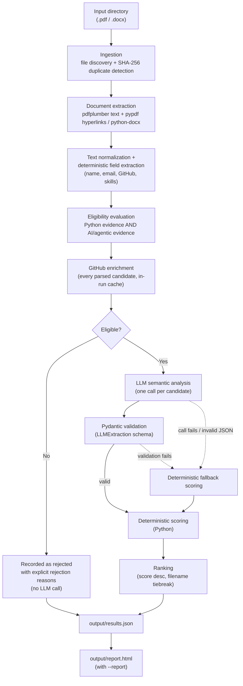

# AI Resume Screening & Ranking System

A Python CLI pipeline that ingests a folder of resumes (PDF/DOCX), filters candidates through a deterministic Python + AI eligibility gate, analyses eligible candidates' projects with an LLM, and produces an explainable, ranked shortlist as JSON plus a static HTML report. The LLM contributes structured evidence only — every score is computed by deterministic Python code, so every number in the output can be traced back to its inputs.

---

## Table of Contents

- [Overview](#overview)
- [Key Features](#key-features)
- [Architecture](#architecture)
- [How It Works](#how-it-works)
- [Scoring Methodology](#scoring-methodology)
- [Example Output](#example-output)
- [Generated Reports](#generated-reports)
- [Example Run (Production Dataset)](#example-run-production-dataset)
- [Reliability & Failure Handling](#reliability--failure-handling)
- [Testing](#testing)
- [Project Structure](#project-structure)
- [Setup](#setup)
- [Configuration](#configuration)
- [Design Decisions](#design-decisions)
- [Limitations](#limitations)
- [Future Improvements](#future-improvements)
- [Security & Secrets](#security--secrets)
- [License](#license)
- [Author](#author)

---

## Overview

Screening a batch of resumes for a role that needs both **Python engineering** and **practical AI/LLM experience** is repetitive, and keyword matching alone is easy to game: a resume can list "LangChain" without ever having built anything with it.

This system takes a directory of resumes and produces:

- a **ranked list of eligible candidates**, each with a 100-point score broken down into five categories, project summaries, strengths, concerns, and any penalties applied;
- a **list of rejected candidates**, each with explicit rejection reasons (rejected candidates are kept in the output, never silently dropped);
- a **batch summary** (parsed, failed, duplicates, eligible, rejected);
- an optional **static HTML report** of the same results.

It deliberately splits the work between two kinds of processing:

| Deterministic (plain Python) | Semantic (LLM) |
|---|---|
| File ingestion, duplicate detection, text extraction | Reading project descriptions |
| Name / email / GitHub / skills extraction | Classifying each project's depth (real implementation vs. thin wrapper vs. tutorial) |
| The hard eligibility gate | Summarising projects, strengths, and concerns |
| **All numeric scoring and ranking** | — |

Deterministic steps are reproducible and cheap; the LLM is used only for the judgement a regex cannot make, and only for candidates who have already passed the eligibility gate.

---

## Key Features

- **PDF ingestion** with `pdfplumber` (text) and `pypdf` (hyperlink annotations)
- **DOCX support** via `python-docx` (paragraphs and table cells)
- **SHA-256 duplicate detection** — duplicates are flagged in the output, not discarded
- **Text normalization** — strips zero-width characters, decorative glyphs, and control characters before any matching
- **Deterministic field extraction** — name, email, GitHub username(s), and a skills catalog match
- **GitHub link recovery from PDF annotations** — finds profiles that exist only as clickable links
- **Hard eligibility gate** — requires both Python evidence and AI/LLM/RAG/agentic evidence
- **LLM semantic project analysis** — one structured call per eligible candidate (Gemini by default; Anthropic and OpenAI supported through the same adapter)
- **Pydantic-validated structured output** for both the LLM response and the final results
- **Deterministic 100-point scoring** with explicit, bounded penalties for shallow AI projects
- **Deterministic fallback scoring** when the LLM call fails
- **GitHub enrichment** from the public REST API, with rate-limit awareness and an **in-run cache**
- **Per-candidate failure isolation** — one bad file or failed API call never aborts the batch
- **JSON output** (`output/results.json`) and a **static HTML report** (`output/report.html`)
- **Terminal summary** printed after each run
- **Synthetic sample resumes** (`samples/resumes/`) for trying the pipeline without real data
- **29 automated tests**, with all external API calls mocked

---

## Architecture



Two details worth noting, because they are easy to get wrong when reading the code:

1. **GitHub enrichment runs for every successfully parsed candidate**, after eligibility has been evaluated but before the eligible/rejected branch. Rejected candidates therefore also carry a `github` block in the output. The GitHub score only contributes to the total for eligible candidates, since only they are scored.
2. **Only eligible candidates reach the LLM.** Rejected candidates are marked `llm_status: "skipped_ineligible"`.

Files that fail to parse (corrupt, unreadable, or empty) exit the flow right after extraction and are recorded with `parse_status: "failed"` and an error message.

---

## How It Works

### 1. Ingestion — `src/ingest.py`

`ingest_directory()` lists every `.pdf` and `.docx` file in the input directory (sorted, for deterministic ordering) and computes a SHA-256 hash of each file's bytes. A file whose hash was already seen is marked `is_duplicate: true` with `duplicate_of` pointing at the first file with that hash. Duplicates are still processed and still appear in the output. Files that cannot be opened are passed through with an `UNREADABLE:` marker so they surface as parse failures rather than disappearing.

This is exact-duplicate detection (the same file submitted twice), not fuzzy matching of different resumes for the same person.

### 2. Document Extraction — `src/pdf_extract.py`, `src/docx_extract.py`

- **PDF text:** `pdfplumber` extracts text page by page.
- **PDF hyperlinks:** `pypdf` walks each page's `/Annots` array and collects every `/A → /URI` target. This is a separate pass because many resume templates render contact links as an icon or a short label ("GitHub") with the real URL stored only in a link annotation. Text extraction alone never sees those URLs; in the production dataset, roughly half of the GitHub profiles were only recoverable this way.
- **DOCX:** `python-docx` extracts text from paragraphs and table cells. DOCX hyperlink targets are not extracted, so GitHub profiles in DOCX files are only found when the URL appears as visible text.

Both extractors return a result object (`ok`, `text`, `hyperlinks`, `error`) instead of raising. An exception, or an extraction that yields no text, produces `ok=False` and the candidate is recorded as a parse failure.

### 3. Text Normalization and Field Extraction — `src/text_normalize.py`, `src/extract_fields.py`

Normalization replaces zero-width characters, decorative bullets/arrows, and control characters with spaces and collapses whitespace, so word-boundary regexes behave predictably on text produced by different PDF generators.

Field extraction then runs on every resume, with no LLM involvement:

| Field | How it is extracted |
|---|---|
| `candidate_name` | First non-empty line, if it looks like a name (1–5 alphabetic words); otherwise the first `\|`-separated segment of that line |
| `email` | First regex match |
| GitHub username(s) | URLs found in visible text **merged with** PDF hyperlink annotations, then validated against GitHub's username format, de-duplicated case-insensitively, and with reserved paths (`login`, `settings`, …) rejected. Malformed links (e.g. `https://github.com/` with no username) are kept separately and reported as `invalid_url` |
| `matched_skills` | Word-boundary regex matches against a curated catalog of ~30 technologies (Python, FastAPI, Django, PostgreSQL, Redis, Docker, AWS/GCP/Azure, LangChain, RAG, vector DBs, embeddings, testing frameworks, …) |

### 4. Eligibility — `src/eligibility.py`

A candidate is eligible only if the normalized text contains **both**:

1. **Python evidence** — `python` as a whole word.
2. **AI/LLM/RAG/agentic evidence** — at least one pattern from a curated list in `src/config.py` (LangChain, LangGraph, LlamaIndex, RAG / retrieval-augmented, embeddings, vector databases, tool-calling, multi-agent, agentic, OpenAI/GPT/LLM/Claude/Anthropic references, Hugging Face / transformers, fine-tuning, CrewAI, AutoGen, Google ADK, generative AI, …).

Rejection reasons are fixed strings — `"No evidence of Python stack"` and/or `"No AI/agentic project evidence"` — so a rejection can always be checked against the resume text. The presence of JavaScript, Java, React, or Next.js has no effect on eligibility.

**Why a gate rather than part of the score:** eligibility answers a yes/no question that should be reproducible and free to evaluate, so it stays outside the LLM. It also keeps the LLM cost proportional to the number of relevant candidates. The gate only checks that evidence *exists*; whether that evidence reflects real work is a scoring question (a framework mentioned once in a skills list passes the gate but earns few AI-depth points).

### 5. LLM Semantic Analysis — `src/llm_adapter.py`

Each eligible candidate gets exactly one LLM call. The system prompt asks the model to classify every project/experience entry into a category and a **depth**:

| Depth | Meaning |
|---|---|
| `real_implementation` | Evidence of workflow/orchestration, retrieval, state, backend logic, evaluation, or non-trivial product logic |
| `shallow_wrapper` | Essentially one LLM/API call with no meaningful surrounding logic |
| `tutorial_style` | Listed without implementation detail or evidence of ownership |
| `skill_mention_only` | A framework appears in a skills list with no project describing its use |

The model is explicitly told not to produce a score, and the response schema (`LLMExtraction` in `src/models.py`) has no score field: it contains normalized skills, project summaries, a list of classified projects (each with evidence and reasoning), and per-category evidence lists.

- **Structured output:** for Gemini, the Pydantic model is passed directly as `response_schema` with `response_mime_type="application/json"`. Every provider's response is then parsed with `json.loads` and validated with `LLMExtraction.model_validate()`.
- **Adapter:** `extract_with_llm()` dispatches to `_call_gemini`, `_call_anthropic`, or `_call_openai`. All three share the same prompt and the same parsing/validation path, so switching providers touches no pipeline or scoring code.
- **Input size:** resume text is trimmed to the first 6,000 characters before being sent.
- **Failure handling:** any SDK/network error, timeout, invalid JSON, or schema-validation failure is raised as `LLMCallError`. The pipeline records `llm_status: "failed"` and the error message, then scores the candidate with the deterministic fallback described below.

### 6. GitHub Enrichment — `src/github_enrich.py`

For the first valid username found, the pipeline makes two calls to the public GitHub REST API:

- `GET /users/{username}` — `public_repos`
- `GET /users/{username}/repos?sort=pushed&per_page=10` — the ten most recently pushed repositories

From these it derives two sub-scores (0–5 each):

| Signal | Rule |
|---|---|
| Recent activity | Most recent `pushed_at` among fetched repos: ≤ 30 days → 5, ≤ 90 days → 4, ≤ 180 days → 2, otherwise 0 |
| Relevant repositories | Count of non-fork repos whose language is Python or whose name/description mentions an AI-related keyword (`ai`, `llm`, `agent`, `rag`, `gpt`, `ml`, `bot`, `langchain`, `nlp`), capped at 5 |

Every outcome is represented as a status instead of an exception: `ok`, `not_provided`, `invalid_url`, `not_found` (404), `rate_limited` (403, or `X-RateLimit-Remaining` at or below a floor of 2), `timeout`, or `error`. Once a rate limit is detected, no further GitHub calls are made for the rest of the run.

**In-run cache:** results are cached in memory, keyed by lowercased username, for the duration of one pipeline run. Failures are cached as well, so a username that timed out is not retried within the same run. Nothing is written to disk.

An optional `GITHUB_TOKEN` raises GitHub's rate limit from 60 to 5,000 requests per hour.

### 7. Deterministic Scoring — `src/scoring.py`

`compute_score()` is the only place numeric scores are produced. It combines:

- `matched_skills` from field extraction,
- the AI-pattern hits from the eligibility check (used only by the fallback path),
- the validated `LLMExtraction` (or `None` if the LLM failed),
- the GitHub sub-scores.

Each category is independently capped, and the AI category cannot go below zero after penalties. See [Scoring Methodology](#scoring-methodology) for the exact rules.

The final number is computed in Python rather than generated by the LLM because a model-produced number can change between identical calls and cannot be audited, whereas a formula over structured evidence gives the same result every time and every point can be traced to a matched skill, a classified project, a recorded penalty, or a GitHub signal.

### 8. Ranking and Output — `src/pipeline.py`, `main.py`

Eligible candidates are sorted by total score (descending), with ties broken by filename, and assigned `rank` 1…N. The output lists ranked eligible candidates first, then rejected candidates, then parse failures, so every input file has exactly one record. `main.py` writes the result to JSON, prints a terminal summary, and optionally generates the HTML report.

---

## Scoring Methodology

Scoring applies only to eligible candidates.

| Category | Max Points | Purpose |
|---|---:|---|
| AI / Agentic / RAG Project Depth | 40 | Real AI systems: agents, RAG, retrieval, orchestration, evaluation — judged from the LLM's project classification |
| Python & Backend Engineering | 30 | Python, FastAPI/Django/Flask, PostgreSQL, Redis, async, SQL, Celery |
| Cloud / Deployment / Full-Stack | 15 | GCP/AWS/Azure, Docker, Kubernetes; React/Next.js as supporting signals |
| GitHub Activity | 10 | Recent public activity and relevant repositories |
| Engineering Depth | 5 | Testing, async/concurrency, caching/queues, containerization |
| **Total** | **100** | |

### AI / Agentic / RAG Project Depth (40)

With a successful LLM result:

1. Take up to three projects the LLM categorised as `ai_agentic_rag`.
2. Award **16 base points** for each `real_implementation`, `shallow_wrapper`, or `tutorial_style` project, and **5 points** for a `skill_mention_only` entry. (If the LLM reported AI evidence but no AI project, it is treated as one `skill_mention_only` entry.) Cap the base at 40.
3. Apply penalties, each recorded as a separate `penalties[]` entry in the output:
   - `shallow_wrapper`: **−10**
   - `tutorial_style`: **−8**
4. Floor the result at 0.

Shallow and tutorial projects receive the same base points as real ones on purpose: having an AI project is worth something, and the quality judgement is expressed as a visible deduction rather than hidden inside a lower base value.

**Fallback (LLM unavailable or failed):** `min(4 × number_of_AI_pattern_hits, 24)`. The cap is deliberately below 40 because project depth cannot be judged from keywords alone.

### Python/Backend, Cloud/Full-Stack, Engineering Depth

Points are awarded per matched skill, capped per category, plus a small bonus equal to the number of LLM evidence items for that category (only when the LLM succeeded):

| Category | Points per matched skill | LLM evidence bonus |
|---|---|---|
| Python / Backend (cap 30) | python 10, fastapi 6, postgresql 5, django 4, flask 4, redis 4, async 3, sql 2, celery 2 | up to +5 |
| Cloud / Full-Stack (cap 15) | gcp 6, aws 6, azure 6, docker 5, kubernetes 3, react 2, next.js 2 | up to +3 |
| Engineering Depth (cap 5) | testing 2, async 1, docker 1, redis 1, celery 1 | up to +2 |

The bonus rewards skills that the LLM found being *used* in projects, on top of the keyword baseline.

### GitHub (10)

Recent-activity score (0–5) plus relevant-repositories score (0–5), clamped to 10. Missing or unavailable GitHub data contributes 0 and never causes rejection.

---

## Example Output

The records below are **abbreviated, anonymized excerpts** from the production run (see [Example Run](#example-run-production-dataset)). Scores, statuses, penalties, and error messages are the real values; anything that could identify a candidate — names, emails, GitHub usernames, repository counts, and project names or summaries taken from resume text — has been replaced with `<redacted>`. The production output itself is not part of this repository.

**Eligible candidate (rank 1):**

```json
{
  "rank": 1,
  "file": "candidate_50.pdf",
  "candidate_name": "<redacted>",
  "parse_status": "ok",
  "eligible": true,
  "rejection_reasons": [],
  "matched_skills": ["python", "fastapi", "postgresql", "redis", "docker", "aws",
                     "rag", "vector_db", "embeddings", "async", "celery", "..."],
  "llm_status": "ok",
  "total_score": 100,
  "score_breakdown": {
    "ai_project_depth": 40,
    "python_backend": 30,
    "cloud_fullstack": 15,
    "github": 10,
    "engineering_depth": 5
  },
  "penalties": [],
  "project_summary": "<redacted: LLM summary of the candidate's projects>",
  "strengths": ["<redacted project name>", "<redacted project name>", "..."],
  "concerns": [],
  "github": {
    "status": "ok",
    "username": "<redacted>",
    "public_repos": "<redacted>",
    "recent_activity_score": 5,
    "relevant_repos_score": 5
  }
}
```

**Eligible candidate with penalties applied:**

```json
{
  "rank": 25,
  "file": "candidate_06.pdf",
  "total_score": 63,
  "score_breakdown": { "ai_project_depth": 24, "python_backend": 30,
                       "cloud_fullstack": 4, "github": 3, "engineering_depth": 2 },
  "penalties": [
    { "project": "<redacted project name>", "reason": "tutorial_style", "points": 8 },
    { "project": "<redacted project name>", "reason": "tutorial_style", "points": 8 }
  ],
  "concerns": [
    "<redacted project name>: Lacks specific deployment, dataset scale, or engineering integration details typical of production systems.",
    "..."
  ]
}
```

**Eligible candidate scored via fallback after an LLM failure:**

```json
{
  "rank": 10,
  "file": "candidate_41.pdf",
  "llm_status": "failed",
  "llm_error": "invalid_json_response: Unterminated string starting at: line 100 column 5 (char 6082)",
  "total_score": 77,
  "score_breakdown": { "ai_project_depth": 24, "python_backend": 27,
                       "cloud_fullstack": 12, "github": 10, "engineering_depth": 4 },
  "project_summary": "LLM unavailable/failed for this candidate; scored from deterministic keyword evidence only (see matched_skills, score_breakdown)."
}
```

**Rejected candidate:**

```json
{
  "rank": null,
  "file": "candidate_01.pdf",
  "candidate_name": "<redacted>",
  "parse_status": "ok",
  "eligible": false,
  "rejection_reasons": ["No evidence of Python stack", "No AI/agentic project evidence"],
  "matched_skills": ["javascript", "typescript", "react", "next.js", "docker", "sql"],
  "llm_status": "skipped_ineligible",
  "total_score": null,
  "score_breakdown": null,
  "github": { "status": "ok", "username": "<redacted>", "public_repos": "<redacted>",
              "recent_activity_score": 0, "relevant_repos_score": 1 }
}
```

The top level of the file (production run values) is:

```json
{
  "batch_summary": {
    "total_resumes": 50, "successfully_parsed": 50, "failed_to_parse": 0,
    "duplicates_found": 0, "eligible": 33, "rejected": 17
  },
  "candidates": [ "... one record per input file ..." ]
}
```

---

## Generated Reports

### JSON Results — `output/results.json`

The machine-readable output. It contains the batch summary and one record per input file with: parse status and errors, duplicate flags, extracted name/email, matched skills, eligibility and rejection reasons, LLM status and error, total score, score breakdown, penalties, project summary, strengths, concerns, and the GitHub enrichment block. Schemas are defined in `src/models.py` (`PipelineResult`, `CandidateResult`, `ScoreBreakdown`, `PenaltyRecord`, `GitHubEnrichment`, `BatchSummary`).

### HTML Report — `output/report.html`

A human-readable, static HTML page generated from `results.json` by `src/report.py` (standard library only, no JavaScript). It contains:

- **Batch summary** — total, parsed, failed, duplicates, eligible, rejected
- **LLM and GitHub enrichment status** — counts of each LLM and GitHub outcome
- **Top 10 eligible candidates** — rank, name, total score, and the five-category score breakdown
- **Rejected candidates** — filename, candidate name, and rejection reasons
- **Scoring categories** — a short description of the five categories and their maximum points

All values are HTML-escaped before insertion.

Both files are generated locally and are not committed to this repository, because they contain candidate names, emails, and GitHub usernames (see [`output/README.md`](output/README.md)). The report is a plain HTML file — open it in any browser.

To regenerate both outputs:

```bash
python main.py --input ./resumes --output ./output/results.json --report
```

`--report` writes `report.html` next to the JSON output file. The report can also be rebuilt from an existing JSON file without re-running the pipeline:

```bash
python -m src.report --input output/results.json --output output/report.html
```

Then open it locally, for example:

```bash
start output/report.html      # Windows
open output/report.html       # macOS
xdg-open output/report.html   # Linux
```

---

## Example Run (Production Dataset)

These aggregate figures come from one run over a dataset of 50 real PDF resumes, using Gemini (`gemini-3.5-flash-lite`) with a `GITHUB_TOKEN` configured. They describe that run, not guarantees about other inputs.

The resumes and the generated `results.json` / `report.html` from that run are **not included in this repository** because they contain personal information. Only aggregate numbers (and the anonymized excerpts in [Example Output](#example-output)) are published here.

| Metric | Value |
|---|---:|
| Resumes processed | 50 |
| Successfully parsed | 50 |
| Failed to parse | 0 |
| Duplicates | 0 |
| Eligible | 33 |
| Rejected | 17 |
| LLM analyses succeeded | 30 |
| LLM failures (fallback scoring used) | 3 — two truncated/invalid JSON responses, one timeout |
| GitHub `ok` / `not_found` / `not_provided` / `invalid_url` | 42 / 1 / 6 / 1 |
| GitHub `rate_limited` / `timeout` | 0 |
| Score range (eligible candidates) | 32 – 100 |
| Candidates with penalties applied | 2 |

All three LLM failures were isolated to their own candidates; each was still scored and ranked.

---

## Reliability & Failure Handling

The pipeline processes candidates in a single loop, and every stage that can fail produces a status on that candidate's record instead of an exception that escapes the loop. One bad resume or one failed API call costs one candidate's data at most — never the batch.

| Failure | Handling | Visible in output as |
|---|---|---|
| File cannot be opened | Hash step records it as unreadable | `parse_status: "failed"`, `parse_error: "UNREADABLE: …"` |
| Corrupt or unsupported PDF / DOCX | Extractor catches the exception, returns `ok=False` | `parse_status: "failed"`, `parse_error` |
| Document yields no text (e.g. image-only PDF) | Explicit empty-text check | `parse_error: "empty_text_extraction"` |
| PDF hyperlink extraction fails | Text is kept; hyperlinks treated as empty | — (candidate continues) |
| Unexpected error in field extraction or eligibility | Caught in the pipeline | `parse_status: "failed"` with the error |
| Malformed GitHub URL | Kept separately, never queried | `github.status: "invalid_url"` |
| GitHub 404 / 403 / timeout / network error | Status returned, never raised | `not_found` / `rate_limited` / `timeout` / `error` |
| GitHub rate limit reached | Remaining calls skipped for the run | `github.status: "rate_limited"` |
| LLM network error, auth error, or timeout | Wrapped as `LLMCallError` | `llm_status: "failed"`, `llm_error`, fallback score |
| LLM returns invalid JSON | `json.loads` failure → `LLMCallError` | same as above |
| LLM JSON fails schema validation | Pydantic error → `LLMCallError` | same as above |
| No LLM provider configured | `LLMCallError("no_llm_provider_configured…")` | every eligible candidate uses fallback scoring |

There is no retry logic: a failed LLM or GitHub call is recorded once and the candidate continues with the information available.

---

## Testing

```bash
python -m pytest tests/ -v
```

29 tests across 7 files, all passing. External services are mocked with `unittest.mock`, so the suite makes no network calls and does not need API keys.

| File | Tests | Covers |
|---|---:|---|
| `test_eligibility.py` | 5 | Python + AI → eligible; Python only, AI only, and neither → rejected with the right reasons; JS/React alongside Python + AI stays eligible |
| `test_github_extract.py` | 6 | URL in visible text; URL only in a hyperlink annotation; malformed `github.com/` flagged as invalid; duplicate links de-duplicated; http/https normalization; no GitHub present |
| `test_scoring.py` | 4 | Shallow-wrapper penalty lowers the score; penalties never go below zero; every category respects its cap; fallback scoring stays bounded |
| `test_reliability.py` | 2 | A corrupt file does not stop the batch; a mocked LLM failure falls back to deterministic scoring (LLM and GitHub both mocked) |
| `test_github_cache.py` | 4 | First lookup calls the API; repeat lookup is served from cache; different usernames don't share results; a cached failure is not retried |
| `test_report.py` | 6 | Report sections present; summary and scores rendered; candidate names HTML-escaped; rejection reasons rendered; file written to disk |
| `test_docx_extract.py` | 2 | Text extracted from a generated DOCX; a corrupt DOCX fails cleanly |

---

## Project Structure

```
.
├── main.py                  # CLI entry point: --input, --output, --verbose, --report
├── src/
│   ├── config.py            # Weights, thresholds, LLM/GitHub settings, eligibility patterns, .env loader
│   ├── models.py            # Pydantic schemas: LLM contract and output contract
│   ├── ingest.py            # File discovery and SHA-256 duplicate detection
│   ├── pdf_extract.py       # PDF text (pdfplumber) + hyperlink annotations (pypdf)
│   ├── docx_extract.py      # DOCX text extraction (python-docx)
│   ├── text_normalize.py    # Unicode/whitespace cleanup before matching
│   ├── extract_fields.py    # Name, email, GitHub username(s), skills catalog
│   ├── eligibility.py       # Deterministic Python + AI eligibility gate
│   ├── llm_adapter.py       # Provider-agnostic structured LLM call (Gemini / Anthropic / OpenAI)
│   ├── github_enrich.py     # GitHub REST enrichment, rate-limit handling, in-run cache
│   ├── scoring.py           # Deterministic scoring, penalties, fallback
│   ├── pipeline.py          # Orchestration, ranking, batch summary
│   └── report.py            # Static HTML report generator
├── tests/                   # 29 tests (7 files)
├── samples/
│   ├── README.md            # Explains that all samples are synthetic
│   └── resumes/             # 3 synthetic .docx resumes (fictional people)
├── resumes/
│   └── README.md            # Put your own resumes here (contents git-ignored)
├── output/
│   └── README.md            # Generated results.json / report.html land here (git-ignored)
├── requirements.txt
├── .env.example
└── .gitignore
```

---

## Setup

Requires Python 3.10+ (the code uses `X | None` type syntax); developed with Python 3.12.

**1. Clone the repository**

```bash
git clone https://github.com/Utkarshum7/kasparro-ai-resume-screener.git
cd kasparro-ai-resume-screener
```

**2. Create and activate a virtual environment**

```bash
python -m venv .venv
.venv\Scripts\activate        # Windows
source .venv/bin/activate     # macOS / Linux
```

**3. Install dependencies**

```bash
pip install -r requirements.txt
```

`anthropic`, `openai`, and `google-genai` are only needed for the provider you use, but all three are listed so any provider works out of the box.

**4. Configure environment variables**

```bash
copy .env.example .env        # Windows
cp .env.example .env          # macOS / Linux
```

Set one LLM key (for example `GEMINI_API_KEY`) and, optionally, `GITHUB_TOKEN`. The pipeline also runs with no keys at all — eligible candidates are then scored with the deterministic fallback.

**5. Run the pipeline**

Try it on the synthetic samples first:

```bash
python main.py --input ./samples/resumes --output ./output/results.json --report
```

To screen your own resumes, put `.pdf` / `.docx` files in `resumes/` (ignored by Git) and run:

```bash
python main.py --input ./resumes --output ./output/results.json --report
```

Add `--verbose` for debug logging.

**6. Run the tests**

```bash
python -m pytest tests/ -v
```

**7. Open the HTML report** — open the generated `output/report.html` in a browser.

---

## Configuration

Settings are read from environment variables. `src/config.py` includes a small `.env` loader; variables already set in the environment take precedence over `.env`.

| Variable | Required | Default | Purpose |
|---|---|---|---|
| `GEMINI_API_KEY` | One LLM key recommended | — | Enables the Gemini provider |
| `GEMINI_MODEL` | No | `gemini-3.5-flash-lite` | Gemini model name |
| `ANTHROPIC_API_KEY` | No | — | Enables the Anthropic provider |
| `ANTHROPIC_MODEL` | No | `claude-sonnet-4-5` | Anthropic model name |
| `OPENAI_API_KEY` | No | — | Enables the OpenAI provider |
| `OPENAI_MODEL` | No | `gpt-4o-mini` | OpenAI model name |
| `LLM_PROVIDER` | No | auto-detected | Force `gemini`, `anthropic`, or `openai` |
| `GITHUB_TOKEN` | No | — | Raises the GitHub API limit from 60 to 5,000 requests/hour |

**Provider selection:** if `LLM_PROVIDER` is not set, the first key found is used, in the order Anthropic → OpenAI → Gemini. With no key, every eligible candidate is scored via the fallback path.

**Model default:** `gemini-3.5-flash-lite` — the model used for the production run — is both the code default in `src/config.py` and the value in `.env.example`. Setting `GEMINI_MODEL` overrides it. Model availability changes over time, so if a call fails with a "model not found" error, set `GEMINI_MODEL` to a currently available model.

Other tunables (scoring caps, request timeouts of 30 s for the LLM and 6 s for GitHub, `max_output_tokens=1500`, the recency window, eligibility patterns) live in `src/config.py` and `src/scoring.py`.

---

## Design Decisions

**Deterministic eligibility before any LLM call.** The yes/no gate is a regex check: reproducible, free, and auditable. Candidates who fail it never incur an LLM call — 17 of the 50 in the production run.

**LLM for evidence, Python for numbers.** The model classifies project depth and writes summaries; the schema contains no score field. Scores come from fixed formulas, so the same evidence always produces the same score and every point is explainable from the output record. The trade-off is less nuance than a free-form model judgement, in exchange for reproducibility.

**Structured output with Pydantic.** The same schema library defines the LLM contract and the output contract. Malformed responses become a single, well-defined failure path instead of fragile text parsing.

**Provider adapter.** One entry point with per-provider implementations behind it. This was exercised in practice: the configured Gemini model had to be changed twice during development (one deprecated, one overloaded) without any change to pipeline or scoring code.

**Text plus hyperlink extraction for PDFs.** Two libraries are used because they solve different problems: `pdfplumber` for text, `pypdf` for link annotations that text extraction cannot see.

**Per-candidate failure isolation.** Every module returns a result/status object; the pipeline loop records failures and moves on. More boilerplate, but failures are specific, visible in the output, and never batch-fatal.

**GitHub as an additional signal, not a requirement.** It is capped at 10 points and missing data scores 0. Only two REST calls per user keep the API footprint small; the cost is a coarser signal (last-push recency and repository relevance, not commit history).

**In-run cache only.** A dictionary for the lifetime of one run removes duplicate lookups (some resumes repeat the same GitHub link many times) with no invalidation concerns. Cross-run persistence is listed under future improvements.

**CLI, no web service, no database, no frontend.** The workload is a bounded batch processed once per invocation, and the output is a JSON file plus a static report. A web API, persistence layer, or UI would add infrastructure without changing what the system computes; `run_pipeline()` returns a Pydantic model, so an HTTP wrapper could be added later without touching the core.

**Sequential processing.** Simple to reason about and debug at this batch size; it is the main thing to change for larger workloads.

---

## Limitations

- **Sequential processing** — LLM and GitHub calls run one candidate at a time.
- **No retries** — transient LLM/GitHub failures fall back immediately rather than being retried.
- **In-memory, per-run cache** — repeated runs re-fetch GitHub data.
- **LLM output dependency** — `max_output_tokens=1500` can truncate responses for resumes with many projects (the cause of two invalid-JSON failures in the production run); only the first 6,000 characters of each resume are sent.
- **Keyword-based eligibility** — the AI pattern list is curated, not exhaustive, and broad terms (e.g. "agents", "NLP", "transformers") can match non-AI contexts. A candidate using uncommon phrasing could be misclassified.
- **Heuristic name extraction** — uses the first line of the document; two-column headers can break it (one of 50 in the production run).
- **PDF extraction variability** — text order depends on the PDF's structure; image-only PDFs are not OCR'd and are reported as parse failures.
- **DOCX hyperlinks are not read** — only visible URLs are found in DOCX files.
- **Coarse GitHub relevance** — keyword matching on repository names/descriptions is substring-based.
- **No ranking evaluation set** — scoring weights and penalties have not been calibrated against labelled data.
- **No persistent job queue or web service** — it is a batch CLI.
- **Plaintext personal data** — output files contain candidate names and emails without access control.

---

## Future Improvements

- **Bounded concurrency** for LLM and GitHub calls (e.g. a small thread pool), the largest wall-clock win for bigger batches.
- **Retry with backoff** for transient LLM and GitHub errors before falling back.
- **Persistent caching** — GitHub results with a TTL, and LLM results keyed by resume content hash, to avoid repeat cost across runs.
- **Layout-aware extraction** (e.g. clustering text by x-coordinate) to fix multi-column headers, plus optional OCR for image-only PDFs.
- **Section-aware parsing** so skills found in project descriptions can be weighted differently from skills lists.
- **Evidence grounding checks** — verify that the LLM's quoted evidence actually appears in the resume text.
- **Evaluation dataset** of labelled resumes to calibrate weights and penalties and measure ranking quality.
- **Observability** — per-run metrics (LLM/GitHub failure rates, latency, token usage and cost) instead of log lines only.
- **Provider fallback** — retry a failed call on a secondary model/provider before using deterministic fallback.
- **HTTP API** around `run_pipeline()` if the system needs to be called by other services.

---

## Security & Secrets

- API keys and tokens are read only from environment variables; nothing is hard-coded.
- `.env` is listed in `.gitignore`. `.env.example` contains variable names with empty values.
- `GITHUB_TOKEN` is optional; the GitHub integration works unauthenticated at a lower rate limit.
- The HTML report escapes all values taken from resumes.
- Resumes and generated outputs contain personal information (names, emails, GitHub usernames). The contents of `resumes/` and `output/` are ignored by Git so real data is not committed by accident; the production dataset and its outputs are deliberately not part of this repository.
- `samples/resumes/` contains only synthetic, fictional resumes, with no GitHub links (running them never queries a real GitHub account).

---

## License

No license is currently specified for this repository.

---

## Author

Utkarsh Amaresh
